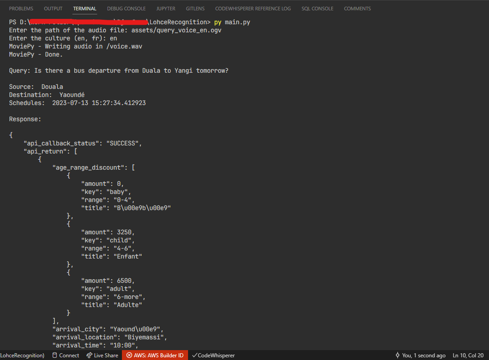

# LohceRecognition
A solution for transcribing audio input query to text to facilitate the user experience of lohce services.

This solution currently support only english language for transcribing as well as interpreting the query. Newer versions will include french support

## Setup
First thing first, you need to install the [Python 3.11.3](https://www.python.org/downloads/release/python-3113/) interpreter on your local machine.

### 1. Clone the project
Once in your working directory, run the following command:

``` shell
git clone https://github.com/Djoufson/Lohce-Recognition.git
```
And then open the created `Lohce-Recognition` in your favorite python IDE or text editor.

### 2. Restore dependencies
From the `requirements.txt` file, download all the registered dependencies. Assuming you are in the same directory as this file, you can download them at once using the command:

``` shell
pip install -r requirements.txt
```

### 3. One more step
Finally, you have to type some additional commands to ensure that everything will work fine.
In the commands.txt file are registered the commands you should manually type. Notice that some of them may require an Internet connection in order to download the necessary tools.

Here are the commands you should enter manually and individually

``` shell
pip install -U pip setuptools wheel
```
``` shell
pip install setuptools-rust
```
``` shell
python -m spacy download en_core_web_sm
```
``` shell
python -m spacy download fr_core_news_sm
```

## Run the project
After downloading and setting up the project, it's finally time to run and test it.

Assuming you are in the correct directory, in your terminal you should be able to see the `main.py` file by typing the `ls` command (corresponding to `dir` on windows OS). Therefore, all you have to do is type:

``` shell
py main.py
```

And you can fill the prompted inputs.

Here is the output you should get after properly filled the audio path and the culture. Make sure you have a stable Internet Connection



This test was made the 12-07-2023 at 03:27 PM

## Disclaimer
- The application only support english inputs
- The audio transcriber may in some cases mis-transcribe the input, depending on the audio quality, noise context or even pronouncement.
- Since the model we used is based on en-US culture, some cities of Cameroon may not be recognized properly while extracting informations from the string query.

Be aware of all these warnings before testing the application.

## Tools
The application workflow can be splitted in three main parts:

- **`Speech Recognition`**

    For speech recognition, we used several methods and libraries, especially:

    - [Vosk](https://alphacephei.com/vosk)
    - [Assembly AI](https://www.assemblyai.com/)
    - [OpenAI Whisper](https://openai.com/research/whisper)

- **`Information Extraction`**

    For information extraction we used the [spaCy](https://spacy.io/) library

- **`Call to the API`**

    According to the documentation provided [here](https:/github.com/lohce/careathon2023) we are able to properly make a post call to the official Lohce API